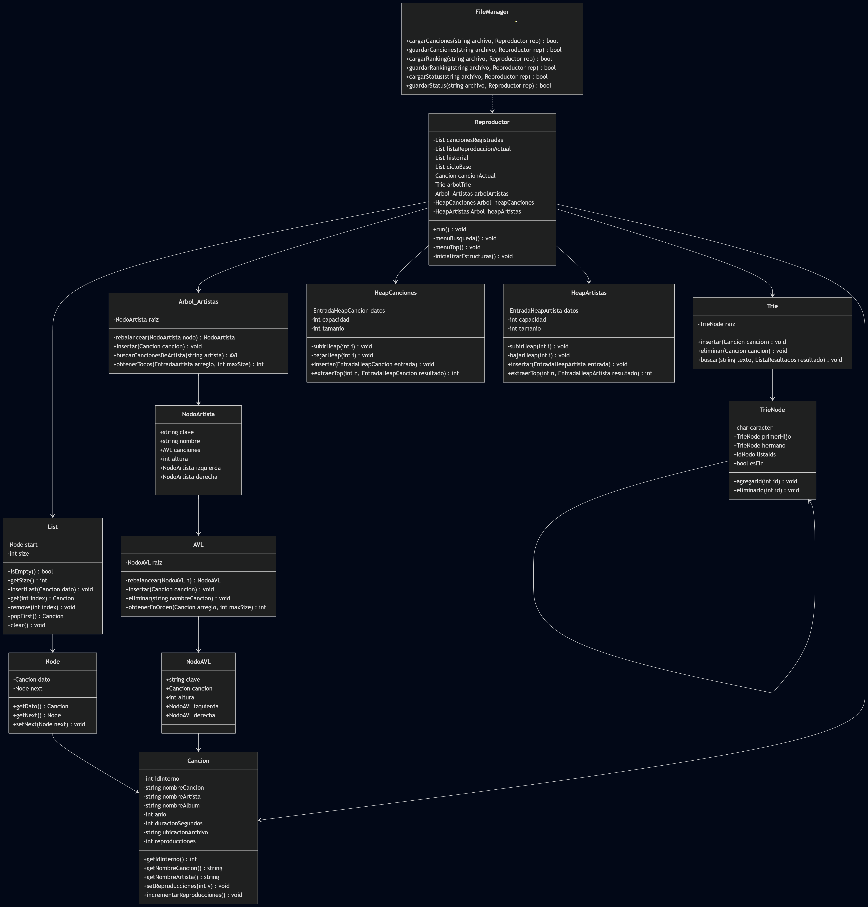

# Reproductor de Música - SoundStructure

### Integrantes del Equipo
* Matías Antonio Collao Valdivia
* Benjamín Ismael Cortés Acuña
* Catalina Isidora Rojas Macaya

## Descripción del Proyecto
Este proyecto consiste en un reproductor de música interactivo por consola desarrollado en C++ para la asignatura de Estructuras de Datos. La aplicación optimiza la gestión, búsqueda y ordenamiento de una biblioteca musical mediante la implementación manual de estructuras avanzadas de datos, omitiendo por completo las librerías nativas de contenedores STL. Integra árboles Trie para búsquedas indexadas de texto por subcadenas, árboles AVL para el almacenamiento y ordenamiento alfabético de pistas por artista, y estructuras Max-Heap para el cálculo eficiente del ranking TOP 10 de reproducciones.

## Funcionamiento de la Aplicación
El sistema opera en una interfaz basada en consola de comandos síncrona con persistencia de datos local en archivos planos (`music_source.txt`, `song_ranking.txt` y `status.cfg`). Ofrece las siguientes funcionalidades principales:

1. **Control de Reproducción (Taller 1):** Operaciones básicas de reproducción (Play/Pause), control de pistas (Siguiente/Anterior), modo aleatorio (*shuffle*) y tres estados de repetición (Desactivado, Repetir una, Repetir todas).
2. **Búsqueda Avanzada (F):** Permite encontrar canciones o artistas mediante la introducción de subcadenas alfanuméricas. Devuelve un listado numerado con opciones para reproducir inmediatamente o añadir al final de la cola de reproducción actual.
3. **Ranking TOP 10 (T):** Despliega dinámicamente dos tipos de rankings basados en contadores de reproducción:
    * **TOP 10 Canciones:** Ordenadas de mayor a menor reproducción. En caso de empate, aplica un desempate alfabético por nombre de canción y luego por artista.
    * **TOP 10 Artistas:** Ordenadas por el acumulado total de reproducciones de sus obras. Incluye un submenú para inspeccionar de manera aislada las canciones del artista en orden alfabético.

## Estructuras de Datos Utilizadas
Para cumplir con las restricciones de rendimiento del taller, no se utiliza la biblioteca estándar STL de contenedores. En su lugar se codificaron nodo a nodo las siguientes estructuras:
* **Lista Enlazada Simple (`List`):** Gestiona el registro global de canciones, la cola de reproducción activa, el historial de pistas anteriores y el ciclo base.
* **Árbol Trie de Sufijos (`Trie`):** Indexa cada sufijo alfanumérico del nombre de la canción y del artista. Permite realizar búsquedas de subcadenas en tiempo lineal respecto a la longitud del patrón de búsqueda.
* **Árbol AVL (`Arbol_Artistas` y `AVL`):** Árboles binarios auto-balanceados por altura. Garantizan operaciones de inserción, eliminación y búsqueda en tiempo logarítmico $O(\log n)$, manteniendo las canciones indexadas alfabéticamente de forma automática.
* **Max-Heap (`HeapCanciones` y `HeapArtistas`):** Árboles binarios semiordenados representados mediante arreglos dinámicos manuales. Permiten la inserción en tiempo $O(\log n)$ y la extracción del máximo en $O(\log n)$ para la generación de rankings prioritarios.

## Instrucciones de Compilación y Ejecución

El proyecto se compila y ejecuta desde consola. No depende de un IDE específico para su construcción.

El código fuente se encuentra separado en:

```text
include/    # Archivos de cabecera .hpp
src/        # Archivos de implementación .cpp
```

Antes de ejecutar, el archivo `music_source.txt` debe estar ubicado en la raíz del proyecto, al mismo nivel que el `Makefile`.

### Requisitos

Para compilar el proyecto se necesita:

- Compilador `g++` compatible con C++17.
- `make` o `mingw32-make`, según el sistema operativo.

### Compilación con Makefile

Desde una terminal ubicada en la raíz del proyecto, ejecutar:

#### Windows con MinGW

```bash
mingw32-make
```

#### Linux, Mac o WSL

```bash
make
```

Esto genera el ejecutable:

```text
reproductor.exe
```

### Ejecución

#### Windows

```bash
.\reproductor.exe
```

O también:

```bash
mingw32-make run
```

#### Linux, Mac o WSL

```bash
./reproductor.exe
```

O también:

```bash
make run
```

### Compilación manual sin Makefile

Si no se desea utilizar `make`, el proyecto también puede compilarse directamente con `g++` desde la raíz del proyecto:

```bash
g++ -std=c++17 -Wall -Wextra -Iinclude src/main.cpp src/Cancion.cpp src/Node.cpp src/List.cpp src/Reproductor.cpp src/Reproductor_menus.cpp src/FileManager.cpp src/NodeAVL.cpp src/AVL.cpp src/Nodeartista.cpp src/Arbolartista.cpp src/TriNode.cpp src/Trie.cpp src/Heap.cpp -o reproductor.exe
```

Luego se ejecuta con:

#### Windows

```bash
.\reproductor.exe
```

#### Linux, Mac o WSL

```bash
./reproductor.exe
```

### Limpieza de archivos generados

#### Windows con MinGW

```bash
mingw32-make clean
```

#### Linux, Mac o WSL

```bash
make clean
```

## Diagrama de Clases (Estándar UML)


